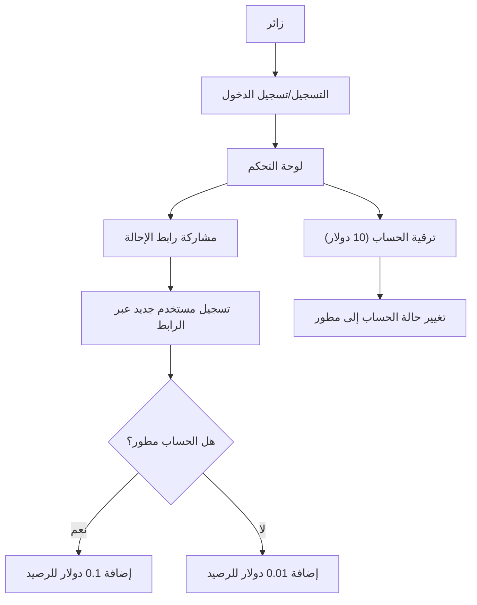

## 1. نظرة عامة على المنتج
موقع للربح من الإحالات مبني باستخدام لغة بايثون ومصمم ليكون جاهزاً للرفع على منصة Render.
- يهدف الموقع إلى السماح للمستخدمين بالتسجيل مجانًا والبدء في كسب الأموال عن طريق دعوة الآخرين.
- القيمة المضافة: نظام مستويات للأرباح (عادي ومطور) لتحفيز المستخدمين على الترقية لزيادة أرباحهم.

## 2. الميزات الأساسية

### 2.1 أدوار المستخدمين
| الدور | طريقة التسجيل | الصلاحيات الأساسية |
|------|---------------------|------------------|
| مستخدم عادي | البريد الإلكتروني وكلمة المرور | تصفح لوحة التحكم، الحصول على رابط الإحالة، كسب 0.01 دولار لكل إحالة |
| مستخدم مطور | الترقية مقابل 10 دولار | جميع الصلاحيات السابقة، بالإضافة إلى كسب 0.1 دولار لكل إحالة |

### 2.2 الوحدات الوظيفية
1. **الصفحة الرئيسية (Landing Page)**: قسم البطل (Hero)، شرح الفكرة، أزرار التسجيل والدخول.
2. **لوحة التحكم (Dashboard)**: عرض الرصيد، رابط الإحالة الخاص بالمستخدم، عدد الإحالات، وزر لترقية الحساب.
3. **صفحة التسجيل/تسجيل الدخول (Auth)**: نماذج إدخال البيانات.

### 2.3 تفاصيل الصفحات
| اسم الصفحة | اسم الوحدة | وصف الميزة |
|-----------|-------------|---------------------|
| الرئيسية | قسم البطل | رسالة ترحيبية تشرح كيفية الربح من الإحالات |
| لوحة التحكم | الإحصائيات | عرض الرصيد الحالي وعدد الأشخاص المسجلين عبر الرابط |
| لوحة التحكم | رابط الإحالة | صندوق يحتوي على الرابط الفريد مع زر لنسخه |
| لوحة التحكم | الترقية | زر لترقية الحساب إلى "مطور" بتكلفة 10 دولار |

## 3. العمليات الأساسية
يقوم المستخدم بالتسجيل مجاناً ويحصل على رابط إحالة خاص به. يشارك الرابط مع الآخرين، وعندما يسجل شخص جديد عبر الرابط، يحصل المستخدم الأول على مكافأة (0.01 دولار للعادي و0.1 دولار للمطور). يمكن للمستخدم العادي ترقية حسابه بـ 10 دولار لزيادة أرباحه من الإحالات المستقبلية.

## 4. تصميم واجهة المستخدم
### 4.1 نمط التصميم
- الألوان الأساسية: الأزرق الداكن والأخضر (للدلالة على الأرباح والنمو).
- نمط الأزرار: أزرار دائرية الحواف (Rounded) مع تأثيرات عند التمرير (Hover).
- الخطوط: خطوط عربية حديثة مثل (Tajawal أو Cairo).
- التخطيط: تصميم يعتمد على البطاقات (Card-based) لعرض الإحصائيات.

### 4.2 نظرة عامة على تصميم الصفحات
| اسم الصفحة | اسم الوحدة | عناصر واجهة المستخدم |
|-----------|-------------|-------------|
| الرئيسية | قسم البطل | تصميم جذاب، نصوص واضحة، ألوان متناسقة، أزرار بارزة للتسجيل |
| لوحة التحكم | الإحصائيات | بطاقات (Cards) لعرض الرصيد وعدد الإحالات، أيقونات توضيحية |

### 4.3 التجاوب
تصميم متجاوب بالكامل (Desktop-first) مع تحسينات ممتازة لشاشات الهواتف المحمولة لتسهيل نسخ الروابط والمشاركة من الجوال.