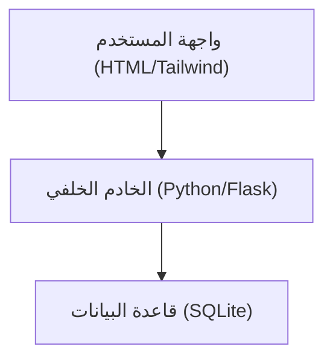
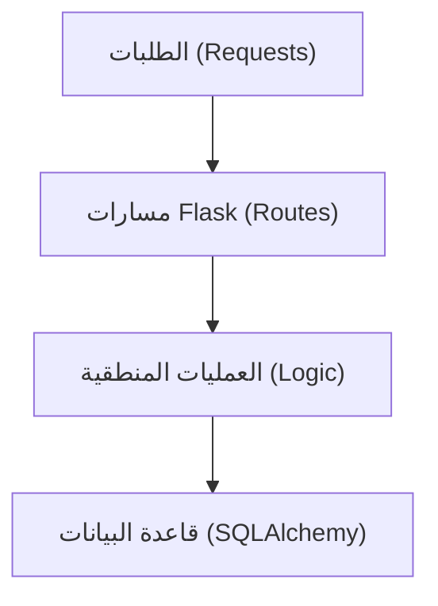
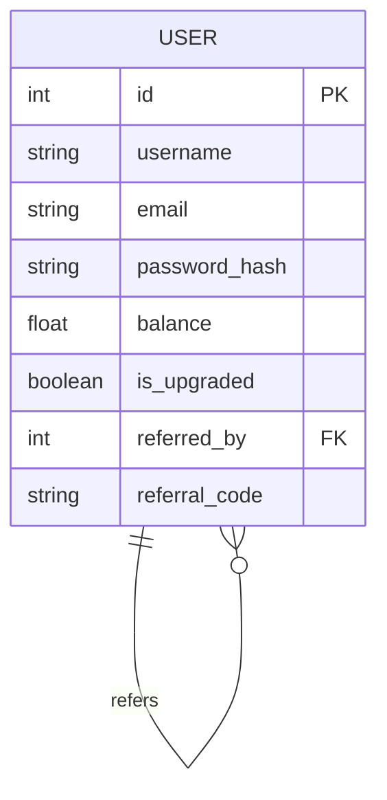

## 1. تصميم الهيكلية


## 2. وصف التقنيات
- **الخادم الخلفي (Backend)**: Python مع إطار عمل Flask.
- **واجهة المستخدم (Frontend)**: قوالب Jinja2 مع Tailwind CSS للتصميم السريع والمتجاوب.
- **قاعدة البيانات**: SQLite (مناسبة للبداية وسهلة الرفع على Render).
- **التجهيز للرفع (Deployment)**: ملف `requirements.txt` و `gunicorn` كخادم ويب جاهز لـ Render.

## 3. تعريفات المسارات (Routes)
| المسار | الغرض |
|-------|---------|
| `/` | الصفحة الرئيسية (Landing Page) |
| `/register` | تسجيل مستخدم جديد (دعم معلمة `ref` لتتبع الإحالات) |
| `/login` | تسجيل دخول المستخدمين |
| `/logout` | تسجيل الخروج |
| `/dashboard` | لوحة تحكم المستخدم لعرض الإحصائيات ورابط الإحالة |
| `/upgrade` | ترقية الحساب إلى مطور (محاكاة عملية الدفع) |

## 4. تعريفات API (إذا لزم الأمر)
- الاعتماد بشكل أساسي على النماذج (Forms) وعمليات إعادة التوجيه (Redirects) بدلاً من REST API معقد لتسريع التطوير وتبسيط الرفع.

## 5. مخطط هيكلية الخادم


## 6. نموذج البيانات (Data Model)
### 6.1 تعريف نموذج البيانات


### 6.2 لغة تعريف البيانات (DDL)
- سيتم استخدام `Flask-SQLAlchemy` لإنشاء الجداول تلقائيًا:
```python
class User(db.Model):
    id = db.Column(db.Integer, primary_key=True)
    username = db.Column(db.String(80), unique=True, nullable=False)
    email = db.Column(db.String(120), unique=True, nullable=False)
    password_hash = db.Column(db.String(256), nullable=False)
    balance = db.Column(db.Float, default=0.0)
    is_upgraded = db.Column(db.Boolean, default=False)
    referral_code = db.Column(db.String(10), unique=True, nullable=False)
    referred_by = db.Column(db.Integer, db.ForeignKey('user.id'), nullable=True)
```